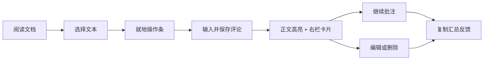
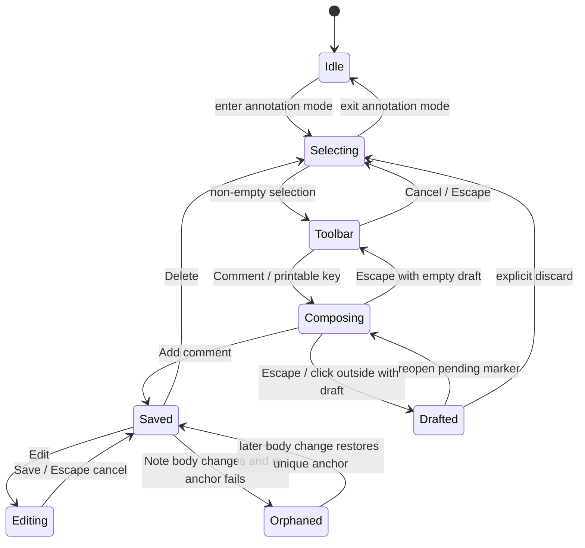

# Decision

Riffle 应移植 Plannotator 的**核心批注交互语法**，而不是移植其完整产品、React 实现或视觉皮肤：

1. 用户显式进入 Note 的批注模式；
2. 在 Readonly View 选择文本，就地出现轻量操作条；
3. 添加评论时，composer 锚定在选区附近；
4. 保存后，正文高亮与右侧评论卡片形成双向定位；
5. 所有评论实时组成一个稳定、面向人和 agent 的 Markdown comment buffer；
6. 用户从右侧栏一键复制整个 buffer，复制不会修改 Note，也不会自动清空评论。

首个完整切片还应支持 general comment、编辑、删除、草稿恢复、失效锚点和跨重启恢复。它明确不包含 Plannotator 的 redline、quick labels、图片附件、Ask AI、分享、协作、代码审查、Vim 模式或多文档 room。

这不是一个 rich-text editing 功能。批注是对 Readonly View 的独立 review overlay；Note 的 Markdown body、frontmatter 和文件格式均保持不变。

# Objective

把「阅读 Note → 发现问题 → 组织反馈 → 复制给人或 agent」压缩成一个连续界面，不再要求用户往返 Source Editor、聊天窗口和临时草稿。

成功结果：

- 用户不离开当前 Note 即可完成整轮 review；
- 每条评论保留足够的上下文，不依赖模糊的“上面那段”；
- comment buffer 无需二次整理即可粘贴到 agent、issue、Slack 或其他工具；
- UI 决策以 Plannotator 已验证的交互为 oracle，避免重新发明一套需要长期讨论才能收敛的批注体验；
- 实现保持 Riffle 原生：Octane、现有 monochrome tokens、现有 Note 生命周期和 renderer-only 权限边界。

# Baseline

本提案基于以下固定基线分析，避免后续把上游变化误当成本提案的一部分：

- Riffle：`9469ae915aa41d50d0ff7f3189204720359f6004`
- Plannotator：`ab8d2581eb49803d8210e6bfcef41b6d583de1a8`
- Plannotator 的公开 annotate UI 截图：[`annotate.webp`](https://github.com/backnotprop/plannotator/blob/ab8d2581eb49803d8210e6bfcef41b6d583de1a8/.github/assets/annotate.webp)

Riffle 当前相关事实：

- `ReadonlyMarkdownView` 将 `ProjectedDocument` 渲染为 `.prose-note`，已经拥有选区查找高亮、滚动定位和 Markdown error state；
- `NoteEditor` 将 frontmatter 与 body 分离，只把 body 交给 Readonly View；
- `NotesWorkspace` 保持打开的 Note view 常驻，tab 切换不 remount；
- `AppShell` 已有 Note header actions 和一个右侧 backlinks rail；
- renderer 负责 UI + state，不得引入 Node、Electron 或原生库；
- per-vault UI session 已通过 localStorage 恢复，适合承载非 Note 数据的本地 review draft。

# What Plannotator gets right

## One continuous review loop

Plannotator 没有把“做标记”“写评论”“查看评论”“发送反馈”拆成不同页面。它将文档置于中心，浮动 toolbar/composer 处理当前选区，右侧 panel 汇总整轮 review，底部 Copy/Share 完成输出。

其核心 journey 是：



这条链路的价值不在某个控件，而在于**空间上下文始终不丢失**：创建发生在原文旁，管理发生在稳定的右栏，输出发生在同一 review session 的末端。

## Progressive disclosure

Plannotator 默认只展示内容。选择文本之后才出现 toolbar；选择 Comment 后才出现 composer；保存后才产生持久 card。复杂能力没有在阅读前全部压到用户面前。

Riffle 应保留这一层级，但增加显式的批注模式，防止普通文本选择与复制被劫持：

- 普通阅读模式：浏览器原生 selection 行为完全不变；
- 批注模式：selection 才触发批注 toolbar；
- 已有评论通过 header badge 暗示，不强迫右栏常驻。

## Local creation, global overview

Plannotator 的 composer 跟随 selection rect，自动在上方/下方翻转并限制在 viewport 内；评论 panel 则保持固定宽度和稳定顺序。局部输入与全局管理各自有唯一 owner，避免一个巨大 modal 同时承担定位和组织。

## Bidirectional navigation

Plannotator 选中 panel card 时会将对应高亮滚动到视口中央；正文的 selected annotation 又会使对应 card 居中。focused 状态是暂时的视觉强化，而不是永久改变正文样式。

这是必须移植的核心合同。只有正文高亮而没有评论导航，会在长 Note 中迅速失去可用性；只有评论列表而没有原文反馈，则会退化成普通 todo list。

## Draft protection and fast keyboard path

Plannotator 的 composer 已验证以下快速路径：

- 有未保存内容时，click outside 不会静默丢弃；
- `Cmd/Ctrl+Enter` 保存，`Escape` 关闭或取消；
- selection toolbar 激活时，直接键入 printable character 会进入评论输入，而不是要求再点一次按钮；
- edit 模式同样支持 `Cmd/Ctrl+Enter` 与 `Escape`。

`CommentPopover` 只有收到 `draftKey` 才能在 unmount 后恢复 draft；固定基线的 `Viewer.tsx` 没有传入它。因此，跨 unmount、切换视图和重启恢复不是 Plannotator 主路径的事实，而是本提案为 Riffle 增加的可靠性决策。

## Output is a product surface

Plannotator 没有把 annotations 当成孤立数据。`exportAnnotations` 负责标题、数量、原文引用、评论类型、分隔与附加上下文，panel 的 Copy 操作提供短暂 Copied 反馈。

Riffle 的 comment buffer 同样必须是一个明确合同：顺序稳定、上下文充分、Markdown 可读、空状态不可复制、复制后不清空。

# Target experience in Riffle

## Entry and exit

在 Note header 的现有 actions 区加入 `Comments` toggle：

- 图标按钮使用现有 28px header action 尺寸；
- 无评论时 tooltip 为 `Annotate note`；
- 有评论时显示 count badge，tooltip 为 `Review N comments`；
- active 状态沿用 Riffle signature：`bg-invert text-invert-ink`；
- 点击进入批注模式并打开右侧 Comments rail；
- 再次点击退出批注模式并关闭 rail，但保留 draft 和已保存评论；
- 进入 Source Editor 时隐藏批注 overlay 和 composer，draft 不丢失；返回 Readonly View 后重新解析锚点并恢复。

批注只覆盖 Note body。v1 不允许对 Note Title、Properties Editor、backlinks rail 或 app chrome 进行批注。

## Right rail ownership

Comments 与 Backlinks 不应并排占据两个右栏，也不应各自直接控制 `AppShell` 宽度。`AppShell` 应将现有右侧区域收敛成一个 context rail slot：

```text
ContextRail = closed | backlinks(noteRel) | comments(noteRel)
```

规则：

- 打开 Comments 时替换 Backlinks；
- 关闭 Comments 后恢复进入批注前的 Backlinks 状态；
- 切换 Note 时 rail 跟随 active Note，不能显示前一个 Note 的评论；
- tab 继续保持 mounted；只切换 visibility，不销毁其 annotation session。

Comments rail 建议沿用 Plannotator 的约 288px 信息密度，并适配 Riffle 现有右栏宽度。不要引入可调宽度，除非真实使用证明评论编辑空间不足。

## Selecting text

批注模式下，在 `.prose-note` 内产生非折叠 selection 后：

1. selection 必须至少包含一个非空白字符；
2. selection 可跨 inline nodes 和 block，但不能跨出当前 article；
3. toolbar 锚定 selection 的最后一个可见 rect，距离边缘至少 12–16px；
4. 下方空间不足时翻到 selection 上方；
5. 滚动、resize 或 Note 重渲染时重新定位；
6. selection 消失、按 `Escape` 或点击 Cancel 后关闭；
7. toolbar 打开时直接输入可打印字符，立即打开 composer 并把该字符写入 draft；
8. toolbar 不拦截 `Cmd+C`，用户仍可复制原文。

v1 toolbar 只提供：

- `Comment`：打开 composer；
- `Copy`：复制选中文本；
- `Cancel`：关闭 toolbar。

不要移植 Delete/redline、Markup、quick labels 或 AI actions。它们会扩张输出模型，却不服务“形成可复制评论 buffer”的核心目标。

## Composer

Composer 是紧邻 selection 的轻量 popover，而不是 modal：

- 顶部显示最多两行的 quote preview；
- 主体为自动聚焦 textarea；
- primary action 为 `Add comment`；edit 状态为 `Save`；
- `Cmd+Enter` 提交；空 draft 按 `Escape` 取消；非空 draft 按 `Escape` 收起 composer 并保留 pending marker，再次激活该 marker 时恢复；edit 状态按 `Escape` 放弃本次修改并恢复已保存评论；
- 空评论不可提交；
- click outside 只有在 draft 为空时才能关闭；有内容时收起并保留 draft，不能静默丢弃；
- pending marker 使用虚线轮廓和小圆点区别于已保存 mark；点击正文 pending marker，或点击 Comments rail 顶部的 `Drafts` 项，重新打开对应 composer；
- viewport clamp 与上下翻转必须在首个切片完成；
- 不需要移植 draggable、图片、skill references 或 Ask AI。

General comment 从 Comments rail 顶部的 `Add general comment` 进入同一个 composer，但不显示 quote preview，也不生成正文高亮。

## Saved annotations

保存 selection comment 后同时发生：

- selection 变为持久 annotation mark；
- 新 card 出现在右栏末尾；
- count badge 更新；
- 新 annotation 成为 selected；
- comment buffer 立即更新；
- draft 被清空。

排序固定为 `createdAt` 升序。编辑不改变位置；删除立即移除 mark 与 card，但应提供短时 undo toast，避免小目标误触导致不可恢复。

## Highlight treatment

Riffle 不应复制 Plannotator 的多类型颜色。这里只有一种 selection comment：

- idle mark：`bg-hover` + 1px `border-line-soft` 或等价 underline，不改变正文前景色；
- hover：`bg-active`；
- selected/focused：`bg-invert text-invert-ink`，沿用 Riffle 的 active grammar；
- orphaned annotation：正文无 mark，card 使用 `text-muted` + warning label，不使用 danger；
- motion：100–160ms ease-out；遵守 `prefers-reduced-motion`。

所有颜色必须来自 `styles.css` semantic tokens。不要硬编码 Plannotator 的黄色、橙色、紫色或 destructive comment 类型色。

## Comment cards

每张 card 显示：

1. section breadcrumb；没有 heading 时显示 `Document`；
2. 一至两行 quote preview；general comment 显示 `General`；
3. 完整评论；
4. Edit 与 Delete actions，仅在 hover、focus-within 或 card selected 时显现；
5. orphaned 时显示 `Original text changed`，仍保留 captured quote 和评论。

点击 card：

- 将 annotation 设为 selected；
- 将正文 mark smooth-scroll 到 viewport center；
- focused 状态短暂加强；
- orphaned card 不滚动，只保留选中状态。

点击正文 mark：

- 选择对应 card；
- 将 card scroll 到 rail 中央；
- 不修改浏览器 selection。

Rail 空状态：

```text
No comments yet
Select text in the note to add feedback.
```

Footer 固定放置 `Copy comments`：

- `0` 条时 disabled；
- 成功后短暂显示 `Copied`；
- clipboard 失败时显示现有 toast error；
- 复制不退出模式，不删除评论，不清空 draft。

## Keyboard and accessibility

必须完成：

- toolbar、composer、card actions 全部可通过 Tab 到达；
- icon-only buttons 有 `aria-label` 与 tooltip；
- Comments toggle 使用 `aria-pressed`；
- rail 使用可识别 heading，count 变化通过克制的 live region 宣告；
- composer textarea 有与 selection/general 状态对应的 accessible label；
- `Cmd+Enter` save，`Escape` cancel/close；
- 打开 composer 时 focus textarea；保存后 focus 返回触发位置或 selected card；
- 删除后 focus 移到相邻 card；最后一条删除后移到 `Add general comment`；
- smooth scrolling 在 reduced motion 下退化为 instant；
- 普通阅读模式不安装 printable-key handler。

不在 v1 添加全局快捷键。先避免与 Riffle command palette、find、Source Editor 和 macOS 文本快捷键冲突；有真实高频需求后再设计。

# Comment buffer contract

Comment buffer 不存储独立副本。comments 是 source of truth，buffer 是纯派生结果。Rail 为了保持 review 时间线按 `createdAt` 展示；buffer 为了让接收者顺序阅读，先输出 general comments，再按正文 block path 与 offset 输出 selection comments，同一位置才以 `createdAt` 破平局。

建议格式：

```markdown
# Review comments: Distributed agent mesh

Note: `architecture/agent-mesh.md`
Comments: 3

## 1. General

同步与异步不应是两个 action 类型；建议把 completion semantics 放进同一 action contract。

## 2. Capability addressing

> agent 想要调用一项能力应该对能力有目录式的感知能力

请明确地址是稳定 identity，还是允许随拓扑变化的 discovery path。

## 3. Failure model

> 只要完成组网们认为模块中的函数就应该透明地可调用

“透明”会隐藏网络分区、超时和幂等性差异。这里需要显式列出远程调用失败语义。
```

生成规则：

- 标题取当前 Note Title；路径使用 Vault-relative `rel`，绝不泄露绝对 filesystem path；
- 标题与评论按普通 Markdown text 输出，必须转义会破坏结构的输入；
- selection comment 输出最近 heading breadcrumb 与 blockquote；
- quote 保留用户选择的完整文本，但折叠连续空白，避免渲染换行制造噪音；
- general comment 使用 `General`；
- general comments 按创建顺序先输出；selection comments 按正文位置输出，同一位置再按 `createdAt`；
- orphaned annotation 继续输出 captured quote，并在 section 后标记 `(original text changed)`；
- 不输出内部 annotation ID、DOM path、offset、body fingerprint 或时间戳；
- 空列表不生成“成功”文本，Copy action直接 disabled；
- export 必须是纯函数，对相同输入产生 byte-identical 输出。

不承诺 Markdown source line number。当前 renderer 投影不暴露稳定 source positions；伪造精确行号比缺少行号更糟。heading + exact quote 已足够让人和 agent 定位。若未来 `ProjectedNode` 提供 source map，再单独扩展格式。

# State model

## Domain types

```ts
type AnnotationAnchor = {
  startBlockPath: number[];
  startOffset: number;
  endBlockPath: number[];
  endOffset: number;
  exact: string;
  prefix: string;
  suffix: string;
};

type NoteAnnotation = {
  id: string;
  kind: "selection" | "general";
  comment: string;
  anchor: AnnotationAnchor | null;
  capturedQuote: string | null;
  section: string | null;
  createdAt: string;
  updatedAt: string;
};

type AnnotationDraft = {
  id: string;
  kind: "selection" | "general";
  comment: string;
  anchor: AnnotationAnchor | null;
  capturedQuote: string | null;
  section: string | null;
  createdAt: string;
  updatedAt: string;
};

type NoteAnnotationDocument = {
  noteRel: string;
  sourceFingerprint: string;
  annotations: NoteAnnotation[];
  composerDrafts: AnnotationDraft[];
  updatedAt: string;
};

type PersistedAnnotationState = {
  version: 1;
  notes: Record<string, NoteAnnotationDocument>;
};

type ResolvedAnnotation =
  | { status: "resolved"; annotation: NoteAnnotation; ranges: Range[] }
  | { status: "orphaned"; annotation: NoteAnnotation };
```

字段名是目标合同，不要求实现机械照抄。`NoteAnnotationDocument` 是一份与 Note 平行的 shadow document，由 annotation store 按 `noteRel` 持有；Note 本身不增加 annotation 字段。关键不变量：

- `PersistedAnnotationState.notes` 的 key、`NoteAnnotationDocument.noteRel` 都使用同一个 Vault-relative path；
- `NoteAnnotation` 和 `AnnotationDraft` 不重复保存 `noteRel`，归属由外层 shadow document 决定；
- general comment/draft 的 `anchor` 和 `capturedQuote` 必须为 `null`；
- selection comment/draft 必须保留 exact quote，即使后续无法重新定位；
- selection 跨 block 时允许产生多个 DOM ranges，但仍是一条 annotation；
- UI 永远消费 `ResolvedAnnotation`，不能假设每个存储记录都有当前 DOM range。

## Anchor strategy

不要直接把 DOM Range 或序列化 HTMLElement path 当作持久数据。Comark projection 更新、wiki link 投影和 Embedded Markup 都可能改变 DOM 包装层。

采用两阶段定位：

1. **结构定位**：基于 projected document 的稳定 block path 与 block 内 text offset 恢复；
2. **quote fallback**：结构定位失败或 exact quote 校验失败时，在最近 section、随后整个 article 内用 `exact + prefix + suffix` 搜索；
3. 找不到唯一可信匹配时标记 orphaned，绝不静默绑定第一个相同字符串。

这继承了 Plannotator 的“先 metadata，后 text search，恢复后再校验”原则，但应在 Riffle 的 projected tree 中声明式实现，不引入 React compatibility layer，也不让第三方 highlighter 随意长期改写 Octane-owned DOM。

## Lifecycle



# Persistence and privacy

Annotations 是 review draft，不是 Note 内容。v1 的持久化合同为：

- storage key 固定为 `riffle:annotations:${vaultRoot}`，以 Vault root 隔离；
- value 是 `PersistedAnnotationState` JSON；`version: 1` 是解析 gate，未知版本 fail closed，不猜测迁移；
- 每个 Note 对应一个 `NoteAnnotationDocument` shadow document，保存 committed annotations、composer drafts、body fingerprint 与更新时间；
- `sourceFingerprint` 是传入 Readonly View 的**精确 Note body**（不含 frontmatter）的 SHA-256，格式为 `sha256:<lowercase hex>`；只在 body load/change 时计算，用于判断是否需要 re-anchor，不作为 Note identity，也不能据此自动认领外部 rename；
- store mutation 先同步更新内存，使 mark、rail 与 buffer 同一帧可见；随后复用现有 session persistence 节奏，在最后一次变更后 250ms debounce 写 localStorage；
- `beforeunload`、切换 Vault 和关闭当前 Vault 前必须 flush pending write；不能依赖尚未执行的 debounce；
- transient UI state（mode open、selected ID、toolbar rect、live DOM ranges）不持久化；
- localStorage 写失败是 non-fatal：保留内存状态并且每轮失败只 toast 一次，不阻断阅读或复制；
- Riffle 内发生 Note rename/move 时，annotation store 在同一 domain event 中把 shadow document 从旧 rel 迁移到新 rel；Note delete 时删除对应 shadow document；
- App 关闭期间发生的外部 rename 无法可靠关联，因为 Note 没有 ID；fingerprint 相同也可能是两个不同文件。v1 不自动迁移，旧 path 的 shadow document 作为不可见 stale record 清理，而不是冒险绑定；
- `Clear all` 必须二次确认；普通 Copy 永不清空；
- 不把 annotations 写进 Markdown、frontmatter、`.markd/`、Cloud publish payload 或 Published Share；
- 不发送网络请求，不引入 telemetry；v1 不支持 attachment，因此没有 asset 生命周期。

选择 localStorage 是有意的产品边界：comment buffer 是当前设备上的临时 review session，不是可移植知识。若未来需要把 annotation 作为 Vault durable data，应以独立 proposal 设计 `.markd/annotations.json`、utility-engine 原子写入、schema migration、外部 rename 和跨设备冲突；不能在当前 store 后面静默替换 adapter，因为两者的生命周期和失败语义不同。

# Architecture and ownership

## Deep modules

复杂度应集中在三个 interface 后面：

1. **Anchor module**：DOM/projected selection ↔ durable anchor ↔ resolved ranges；调用者不感知 fallback 和歧义判定；
2. **Annotation session store**：per-vault/note CRUD、rename/delete reconciliation、版本化 persistence；
3. **Exporter**：`Note + ordered annotations -> Markdown string`，无 clipboard side effect。

Clipboard、toast、focus 和 rail visibility 属于 UI adapter，不进入 exporter。

## Proposed file ownership

| Owner | Responsibility |
| --- | --- |
| `src/lib/note-annotation-anchor.ts` | anchor capture、resolve、quote validation、orphan 判定；纯逻辑与最小 DOM adapter 分离 |
| `src/lib/note-annotation-export.ts` | stable Markdown buffer 生成与 escaping |
| `src/stores/annotations.ts` | `PersistedAnnotationState` owner；同步内存 CRUD、250ms debounced localStorage、flush、schema gate、Note move/delete reconciliation |
| `src/components/annotations/AnnotationSurface.tsx` | article selection、toolbar/composer positioning、highlight click、range lifecycle；TSX 适合这一 imperative browser owner |
| `src/components/annotations/AnnotationToolbar.tsx` | selection actions 与 keyboard path |
| `src/components/annotations/AnnotationComposer.tsx` | create/edit/general draft、focus、submit/cancel |
| `src/components/annotations/AnnotationRail.tsrx` | keyed cards、empty/footer states、edit/delete/navigation；TSRX 拥有可见 control flow |
| `src/components/layout/AppShell.tsrx` | Comments header action 与唯一 context rail slot |
| `src/markdown/readonly-markdown-view.tsx` | 暴露 article/projected block seam，并挂载 AnnotationSurface；不拥有 annotation domain state |

不要创建 Electron bridge 或 utility process engine；这一切都在 renderer 权限内完成。不要让 `NoteEditor` 直接管理每条 annotation；它只提供 active Note body/rel 与视图生命周期。

## Rendering decision

首选声明式 annotation projection：在 projected block/text seam 上按 resolved ranges 拆分 text node，渲染带 `data-annotation-id` 的 mark。这样：

- Octane 始终拥有 DOM；
- Note rerender 会自然重建 marks；
- mark click 是普通 event handler；
- tests 可在 projected tree/interface 上验证，不依赖第三方 DOM mutation timing。

只有 Phase 0 prototype 证明 projected tree 无法支持跨 inline/block selection 时，才考虑把 Plannotator 使用的 `web-highlighter` 类方案封装成单一 adapter。即使采用，也必须在 render 前 cleanup、render 后 restore，并禁止其 state 泄漏到 store interface。

现有 CSS Custom Highlight find 继续拥有 find highlight names。annotation marks 使用 DOM mark，不复用 find registry；两者可以叠加，active annotation 的视觉优先级需明确验证。

# Migration plan

## Phase 0 — Freeze parity and anchor feasibility

- 用一份包含 headings、paragraph、link、wiki link、list、blockquote、code block、table 与 Embedded Markup 的 fixture Note 固定 selection matrix；
- 记录 Plannotator 核心 oracle：selection toolbar、anchored composer、draft protection、双向导航、edit/delete、Copy feedback；
- prototype projected block path、跨 inline selection 和跨 block selection；
- 证明 Note rerender 后 anchor 能恢复，重复 quote 不会错误绑定；
- 在这个 gate 之后冻结 anchor interface，再进入 UI 实现。

Exit gate：普通段落、link 内文本、code block、list item、跨 inline selection 均能 capture + restore；重复文本歧义会 orphan，而不是误绑。

## Phase 1 — Domain and persistence

- 定义 annotation、anchor、resolution 与 persisted schema；
- 实现纯 exporter；
- 实现 per-vault store、schema version、rename/delete reconciliation；
- 加入 body change re-anchor 与 orphan 状态；
- 先以 programmatic ranges 验证，不做最终视觉 polish。

Exit gate：刷新应用后 comments 恢复；Note rename 后仍归属正确；Note delete 后无残留；相同输入导出 byte-identical buffer。

## Phase 2 — Selection and composer

- 在 Readonly View 加 AnnotationSurface；
- 完成 mode gating、selection filtering、toolbar clamp/flip；
- 完成 create/general/edit composer、draft protection 和 keyboard contract；
- 声明式渲染 mark，并完成 mark → annotation select。

Exit gate：用户可连续添加多条评论，不会打断普通 copy/find/link navigation；Source Editor 往返不丢 draft。

## Phase 3 — Context rail and copy loop

- 将 BacklinksSidebar 收敛到 context rail slot；
- 加入 header toggle、count、cards、empty state、双向 scroll；
- 加入 Copy comments、Copied/error feedback、Clear all confirmation 和 delete undo；
- 完成 focus recovery 与 reduced-motion 行为。

Exit gate：从进入模式、三次批注、编辑、删除、复制到退出模式形成一条无断点 journey。

## Phase 4 — Product verification and cleanup

- 在 Electron app 中走查真实长 Note、多个 tabs、Note move/delete、external body edit；
- 验证 light/dark、窄窗口、200% zoom、keyboard-only、reduced motion；
- 验证 find highlight 与 annotation mark 共存；
- 删除 prototype adapter、临时 feature flags 与失效 schema；
- 更新 `CONTEXT.md`，只在功能实际落地后加入正式 domain terms。

# Verification strategy

## Behavioral contracts

自动化测试只守住可观察合同：

- exporter 的顺序、escaping、general/selection/orphan 格式与 deterministic output；
- anchor 对 inline wrapper 变化、跨 block、重复 quote、body edit 的 resolve/orphan 行为；
- persistence schema 恢复、损坏数据 fail-closed、Note rename/delete；
- UI journey：mode off 不拦截 selection；mode on selection → add → card/mark；card/mark 双向定位；edit/delete；copy；
- draft 在 click outside、tab 切换、Source Editor 往返与 reload 后的行为；
- clipboard rejection、storage rejection 和 orphan state 可见且不破坏 Note 阅读。

## Manual parity walkthrough

用同一 fixture 对照 Plannotator annotate surface 与 Riffle：

1. 选中一句话，toolbar 出现在选区附近且不越界；
2. 直接键入文字，composer 打开且首字符没有丢失；
3. click outside，非空 draft 仍在；
4. `Cmd+Enter` 保存，正文和 rail 同时出现 annotation；
5. 创建至少三条，正文 mark 与 card 能双向滚动；
6. 编辑中 `Escape` 恢复原评论，保存不改变排序；
7. 删除可 undo；
8. Copy 得到本文定义的精确 Markdown，UI 显示 Copied，评论仍保留；
9. 修改被引用原文，无法唯一恢复的 card 进入 orphaned，不误绑；
10. 退出模式后 Note 恢复纯阅读体验，再进入时 session 完整恢复。

这里追求行为 parity，不追求像素 parity。最终 UI 必须看起来属于 Riffle，而不是嵌入了一块 Plannotator。

# Non-goals

- 不把 Readonly View 变成 rich-text editor；
- 不把评论写回 Note body、HTML comment 或 frontmatter；
- 不引入 Note ID；
- 不做多人协作、远程同步、分享链接或 Cloud publish；
- 不做 code diff review；
- 不做 redline、deletion、markup、label taxonomy；
- 不做 attachment、voice、AI generation 或 agent terminal；
- 不做移动端或 touch 专用交互；Riffle 当前是 macOS Electron 产品；
- 不复制 Plannotator 的 React hooks、全局产品 chrome、颜色系统或多 surface architecture；
- 不承诺 source line mapping；
- 不在首个切片设计 plugin interface 或通用 annotation framework。

# Rejected alternatives

## Always-on selection interception

拒绝。它会破坏 Riffle 当前清晰的 Readonly View 文本选择与复制。显式 mode 只增加一次进入动作，却避免整个阅读体验被批注机制劫持。

## Comments as Markdown/frontmatter

拒绝。批注是临时 review state，不是 Note 的 durable content。写回 Markdown 会污染 portable source、触发 autosave/conflict/publish，并违反 Readonly View 不修改 body 的合同。

## Persist in `.markd/` for v1

拒绝。`.markd/annotations.json` 会把当前设备上的临时 review draft 升级为 Vault durable data，并立即引入 utility-engine 写入、schema migration、备份、外部 rename 和跨设备冲突合同。只有产品明确要求 annotation 长期跟随 Vault 时才应通过独立 proposal 采用，不能作为 localStorage 的透明 adapter 替换。

## A modal review screen

拒绝。它切断当前 Note、tabs、find、links 和 Riffle navigation，也丢失 Plannotator 最有价值的局部创建 + 全局总览关系。

## Two simultaneous right sidebars

拒绝。Backlinks 与 Comments 同时挤压 720px Note column，在普通窗口宽度下不可接受。单一 context rail slot 保持明确 ownership。

## Copy Plannotator's implementation wholesale

拒绝。Plannotator 的 hook、portal、multi-surface state 和 React composition 解决的是其 browser review product。Riffle 已有 Octane projection、常驻 Note views、semantic tokens 和 per-vault session seam。移植行为合同、重新实现 ownership，机械复制只会引入第二套框架和状态模型。

## CSS Highlight-only annotations

拒绝作为主方案。CSS Custom Highlight 很适合 find，但 comment mark 需要稳定 click target、selected semantics 与 card 双向导航。除非 Chromium 的 hit-testing interface 在目标 Electron 版本上被单独验证并显著简化实现，否则声明式 mark 更可靠。

# Acceptance criteria

提案落地完成必须同时满足：

- Readonly View 有显式、可退出的批注模式，普通 selection 行为不变；
- selection comment 与 general comment 均可创建、编辑、删除；
- composer 锚定、clamp、flip、draft protection 和 keyboard path 完整；
- 正文 mark 与右栏 card 可双向选择和滚动；
- Comments 与 Backlinks 共享唯一 context rail slot；
- per-vault `NoteAnnotationDocument` shadow data、committed annotations 与 composer drafts 跨重启恢复；250ms debounce 在 unload/Vault switch 前 flush；rename/delete 正确 reconciliation；
- Note body、frontmatter、Cloud publish 和 filesystem 不因批注发生变化；
- comment buffer 符合本文格式，deterministic、一键复制、复制不清空；
- Note 更新后 anchor 只在可信时恢复，否则显式 orphan；
- light/dark、keyboard-only、reduced motion、find coexistence 和 clipboard/storage failure 均经过真实场景验证；
- 不存在 React compatibility layer、Electron bridge、旧 prototype、隐藏 feature shim 或未完成 TODO。

# Sources of truth

## Plannotator

所有上游源码引用固定到 `ab8d2581eb49803d8210e6bfcef41b6d583de1a8`：

- [`Viewer.tsx`](https://github.com/backnotprop/plannotator/blob/ab8d2581eb49803d8210e6bfcef41b6d583de1a8/packages/ui/components/Viewer.tsx) — rendered document 与 annotation UI composition
- [`useAnnotationHighlighter.ts`](https://github.com/backnotprop/plannotator/blob/ab8d2581eb49803d8210e6bfcef41b6d583de1a8/packages/ui/hooks/useAnnotationHighlighter.ts) — selection lifecycle、create/restore/remove、selected highlight navigation
- [`AnnotationToolbar.tsx`](https://github.com/backnotprop/plannotator/blob/ab8d2581eb49803d8210e6bfcef41b6d583de1a8/packages/ui/components/AnnotationToolbar.tsx) — anchored actions、copy、Escape、printable-key path、viewport positioning
- [`CommentPopover.tsx`](https://github.com/backnotprop/plannotator/blob/ab8d2581eb49803d8210e6bfcef41b6d583de1a8/packages/ui/components/CommentPopover.tsx) — draft preservation、submit/cancel、focus、flip/clamp、unsaved click-outside behavior
- [`AnnotationPanel.tsx`](https://github.com/backnotprop/plannotator/blob/ab8d2581eb49803d8210e6bfcef41b6d583de1a8/packages/ui/components/AnnotationPanel.tsx) — panel、cards、empty state、edit/delete、selected card scroll、Copy feedback
- [`parser.ts`](https://github.com/backnotprop/plannotator/blob/ab8d2581eb49803d8210e6bfcef41b6d583de1a8/packages/ui/utils/parser.ts) — `exportAnnotations` 输出组织
- [`plan-review shortcuts`](https://github.com/backnotprop/plannotator/tree/ab8d2581eb49803d8210e6bfcef41b6d583de1a8/packages/ui/shortcuts/plan-review) — toolbar、composer、panel 的 declarative keyboard contract
- [`README`](https://github.com/backnotprop/plannotator/blob/ab8d2581eb49803d8210e6bfcef41b6d583de1a8/README.md) — 产品范围、plan annotate flow 与公开 UI 资产

## Riffle

- [`CONTEXT.md`](../CONTEXT.md) — Note、Readonly View、Source Editor、Riffle Markdown 与 Persisted Note Update 的正式语言
- [`AGENTS.md`](../AGENTS.md) — renderer 权限、Note view 生命周期、UI conventions 与 Octane-native 约束
- [`readonly-markdown-view.tsx`](../src/markdown/readonly-markdown-view.tsx) — Markdown projection、find highlights、article seam 与滚动 owner
- [`NoteEditor.tsrx`](../src/components/editor/NoteEditor.tsrx) — Note body/frontmatter split、Readonly/Source mode 与 persisted write ownership
- [`AppShell.tsrx`](../src/components/layout/AppShell.tsrx) — header actions、Note action menu 与右侧 backlinks rail
- [`session.ts`](../src/lib/session.ts) — versioned per-vault renderer session persistence precedent
- [`styles.css`](../src/styles.css) — monochrome semantic tokens、`.prose-note` 与 motion/typography conventions
