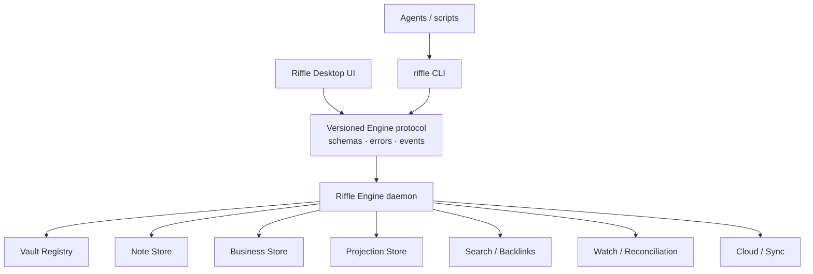
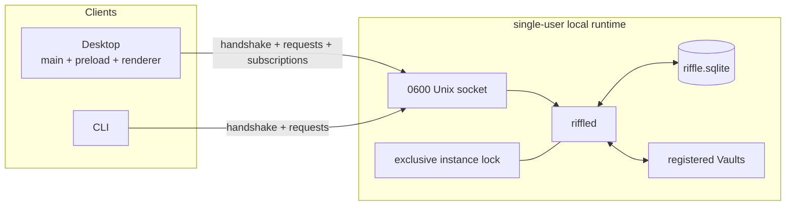
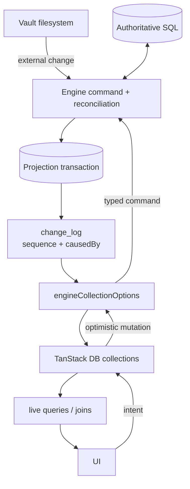
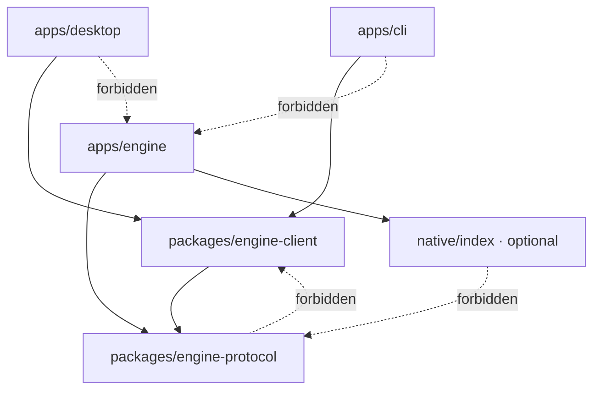

# Decision

Riffle v2 采用 Engine-first 架构：一个常驻本地 `riffled` 进程独占 Vault registry、filesystem effects、
business store、derived projections、watch reconciliation、mutation ordering 与 cloud integration。Desktop 和
CLI 都是同一 versioned Engine protocol 的 client；Desktop renderer 只拥有 presentation state，并通过
TanStack DB collections 消费 Engine 的 relational model。

Vault filesystem 仍是 Markdown Note 与 asset 的 durable source。Engine SQLite 同时承载两类严格区分的
数据：不可从 Vault 重建的 authoritative business data，以及可随时由 Vault 重建的 projections。两者共享
事务引擎，但不共享故障语义、备份策略或 schema ownership。

Riffle v2 的 production runtime 不依赖 Rust。`riffled`、CLI、domain logic、SQLite ownership、reconciliation
policy 与 cloud integration 使用 TypeScript/Bun；只有 profiling 证明需要的 bounded data-plane kernel 才使用
Zig。新产品逻辑不再进入 fff。冻结的 Riffle capability/conformance corpus 是 correctness authority；fff 仅
作为迁移期 differential baseline、ranking characterization 和性能对照，完成 clean cut 后从 Riffle 删除。

# Problem

当前 Electron-native 架构已经把 `VaultEngine` 放入 `utilityProcess`，但 Engine 仍由 Electron 生命周期托管，
通过 `parentPort` 和 Desktop-native callbacks 工作，并假设只有一个 active Vault。FFF 同时拥有 scan、search、
watch 和 resident index，使一个 Engine capability 经常必须跨 Rust、C ABI、Node binding、Electron bridge 与
renderer 才能完成。

这带来四个产品压力：

1. CLI 和 agent 无法直接使用真正的 Riffle domain operations；
2. Engine、Desktop 和 renderer 的生命周期耦合，独立验证仍依赖 Electron journey；
3. renderer 需要协调 snapshot、watch event、optimistic state、external mutation 和 rollback；
4. fff 与上游持续分叉，而 release-only Rust native build 使日常迭代过慢。

v2 不以替换某个语言或数据库为目标。它先固定 ownership 和 protocol，再让实现成为可替换细节。

# Objectives

- `riffle` CLI 与 Desktop 使用完全相同的 Engine behavior。
- agent 可以通过 schema-first CLI 完成查询和 mutation，无需驱动 UI。
- Engine 是 filesystem、business data 和 projection mutation 的唯一 owner。
- renderer 通过 normalized collections 与 live queries 读取统一 relational model。
- 外部编辑器、CLI、agent、Desktop 和 cloud mutation 最终进入同一 ordered change stream。
- Vault document content 保持 portable、local-first，并能在删除 derived projections 后完整重建索引。
- Desktop 功能以 Engine/CLI contract 先行交付；UI 工作只负责 interaction 与 presentation。
- clean cut 后删除旧 Electron-only Engine host、FFF runtime dependency 和重复状态路径。

# Non-goals

- 不把所有 UI transient state 持久化到 SQL。
- 不把 TanStack DB 当成 Engine database、ORM 或 domain model。
- 不把所有 domain operations 压缩成无约束 row CRUD。
- 不建设网络账户服务或通用远程 database protocol。
- 不同时重写 Python、Neovim 或其它 FFF consumers；它们不属于 Riffle v2 runtime。
- 不预先把整个 Engine 写成 Zig，也不迁移尚未被 profiling 证明的 hotspot。
- 不长期维护新旧 Engine、两套 watcher 或 protocol compatibility shims。

# Product invariants

- Vault-relative path 是所有 user-facing location；physical path 不泄漏到 tree、search、links 或 CLI results。
- Markdown Note 与 asset 的 filesystem content 是 document source of truth。
- Engine database 中的 derived projection 可以停止服务、删除并从 Vault 重建。
- Authoritative business tables 不可被当成 index 删除，必须 migration、backup 和 restore。
- 每个 Vault mutation 由一个 Engine actor 串行提交；多个 clients 不创建多个 mutation owners。
- Watcher event 只触发 reconciliation，不直接成为 product truth。
- 每个 accepted change 获得单调递增 sequence；client 不自行猜测是否漏事件。
- CLI 和 Desktop 通过同一 protocol 获得相同 validation、error code 和 canonical result。
- renderer 不读取 Vault filesystem，不直接打开 Engine SQLite，也不实现 domain invariants。
- Engine crash 不损坏已提交的 Vault content；projection failure 通过 stale marker 和 rebuild 恢复。

# Target architecture



The module is deep at the protocol seam: clients know command schemas, result schemas, error codes, event ordering and
lifecycle requirements. They do not know SQLite tables, watcher backends, filesystem transaction recovery, indexing
algorithms or native acceleration.

# Runtime topology



Desktop may start the bundled daemon, but it does not own Engine state. CLI may connect while Desktop is closed. Only the
process holding the instance lock may open the writable Engine database or publish the socket.

# Domain and data ownership

## Document source

Vault filesystem owns:

- Markdown body and frontmatter;
- Note and folder location;
- Vault-relative assets;
- filesystem existence and modification state;
- Vault-owned portable files that a separate decision deliberately keeps under `.markd/`.

The SQL representation of these facts is derived. A scan or reconciliation can replace it without losing user content.

## Authoritative business source

Engine SQLite owns data that cannot be derived from Markdown or the folder tree:

- Vault registry and stable `VaultId`;
- Todos, Bookmarks, Collection membership and Tags after migration from `.markd/collections.json`;
- Pins after migration from `.markd/pins.json`;
- durable Annotations and Comments if v2 promotes them beyond a temporary renderer session;
- durable user settings, operation metadata and sync state.

Moving a domain from Vault App Data to SQLite is a format migration, not a cache optimization. Each migrated domain must
define portability, export, backup, restore and cloud-sync behavior before its old file is removed.

## Derived projection

Engine SQLite may rebuild these tables from the document source and authoritative business tables:

- entries and folder relationships;
- Note properties;
- links and backlinks;
- search documents and rank inputs;
- collection read models;
- projection checkpoints and stale state.

Projection tables carry their source revision and schema version. Rebuild creates a replacement generation and publishes
one coherent reset instead of streaming a partial tree.

## Ephemeral presentation state

Renderer-local state includes active selection, hover, panel geometry, drag preview, dialog input and uncommitted editor
buffers. TanStack DB `LocalOnlyCollection` is allowed when several views genuinely share such state; ordinary component
state remains the default.

## Domain language changes on acceptance

This Proposal deliberately changes two current `CONTEXT.md` statements:

- Vault remains the source of portable document content, while Engine SQLite becomes a second authoritative source for
  explicitly migrated business domains.
- Collection no longer necessarily means structured data stored below `.markd/`; its owner becomes the accepted
  per-domain storage decision.

Acceptance must update `CONTEXT.md` in the same change. Until then, the current path-based Note identity and Vault App
Data definitions remain authoritative, and this draft must not be used to migrate persisted data.

# Relational model

The proposal standardizes one Engine relational model, not one physical table or one monolithic SQL `VIEW`.

```text
Authoritative tables
├── vaults
├── todos
├── bookmarks
├── collection_tags
├── pins
├── annotations          # only if promoted to durable business data
├── comments             # only if promoted to durable business data
├── settings
└── sync_state

Rebuildable projection tables
├── entries
├── notes
├── note_properties
├── links
├── search_documents
├── projection_generations
└── change_log

Named read models
├── note_summary
├── folder_tree
├── note_backlinks
├── active_todos
└── annotated_notes
```

Every row that belongs to a Vault carries `vault_id`. Relative paths are normalized product locations, not database-wide
identity. Authoritative and projection migrations use separate version markers so a rebuild cannot masquerade as a
business-data migration.

## Note identity gate

The accepted domain model currently identifies a Note by Vault-relative path. Durable Annotations, Comments or other
business rows that must survive external rename create pressure for a stable `NoteId`; inode, content hash and path are not
portable stable identities.

v2 does not silently change Note identity. Before migrating any path-attached renderer data into authoritative SQL, a
separate acceptance gate must choose one of these contracts:

1. preserve path identity and accept that only Engine-observed moves can remap attached rows; or
2. introduce a portable Note ID in Vault-owned metadata and update `CONTEXT.md` before implementation.

# Engine modules

| Module | Owns | Does not own |
| --- | --- | --- |
| Runtime | process lifecycle, lock, socket, shutdown, build handshake | domain commands |
| Protocol | schemas, error taxonomy, request IDs, sequence/cursor contract | transport-specific state |
| Vault Registry | `VaultId`, roots, cwd resolution, registration lifecycle | Note indexing |
| Note Store | validated file reads, atomic writes, create/move/rename/trash | UI buffers |
| Business Store | authoritative SQL transactions and migrations | filesystem projections |
| Projection Store | generations, rebuild, SQL read models, change log | source content |
| Reconciler | scan/watch normalization, stale detection, repair | direct UI notification |
| Search | filename/content query, ranking, backlinks | Vault mutation policy |
| Cloud | Published Share and future sync orchestration | renderer auth state |
| Platform Adapter | Trash and other OS capabilities | product validation |

The Engine façade composes these modules but does not absorb their implementations into one god class. Domain code remains
inside the Engine application; clients share only protocol and client transport packages.

# TanStack DB client projection

TanStack DB is the renderer-side normalized store for Engine data. Riffle provides an `engineCollectionOptions` adapter
that loads an atomic snapshot, applies ordered deltas and maps mutations to Engine commands.



## Collection mapping

Stable entity sets and named read models become collections, for example:

- `vaultCollection`;
- `noteCollection`;
- `entryCollection`;
- `todoCollection`;
- `bookmarkCollection`;
- `annotationCollection`;
- `backlinkCollection`.

Components query and join collections instead of copying Engine snapshots into application stores. A component does not
care whether the canonical change originated in Desktop, CLI, an agent, an external editor or cloud sync.

## CRUD and intent commands

Direct collection CRUD is appropriate for one-entity operations whose invariants fit one Engine transaction: Todo,
Bookmark, Tag or simple setting changes.

Filesystem and cross-entity operations remain typed intents:

- `createNote`;
- `writeNote(expectedRevision)`;
- `moveNote` and `renameEntry`;
- `trashEntry`;
- `openDailyNote`;
- import/export;
- operations that update Note location plus Pins, Annotations or backlinks.

A TanStack DB optimistic action may project one intent across several collections, but its persistence handler sends one
Engine command. The renderer never decomposes a domain transaction into unrelated row updates.

## Mutation confirmation

TanStack DB keeps optimistic state until backend persistence and canonical sync-back complete. Riffle therefore correlates
each mutation with `clientMutationId`:

```text
client optimistic mutation
→ Engine command(clientMutationId)
→ filesystem/SQL commit
→ change_log(sequence, causedBy=clientMutationId)
→ collection delta
→ optimistic transaction completes
```

Resolving the mutation handler before the matching canonical delta is applied is invalid because it exposes a transient
rollback between optimistic and synced state.

# Filesystem and SQL consistency

Filesystem and SQLite cannot form one atomic transaction. The Engine uses source-aware recovery rather than pretending
otherwise.

For a Note mutation:

1. validate intent, expected revision, path policy and target collision;
2. perform the atomic filesystem operation;
3. commit the corresponding projection and business-row remap in SQLite;
4. append the ordered change-log entry;
5. publish deltas.

If filesystem commit succeeds but SQL commit fails, the Note remains authoritative. Engine marks the projection stale,
blocks dependent mutations when necessary and reconciles from disk. It does not attempt an unsafe inverse filesystem
operation after the committed source became externally visible.

Pure business mutations commit entirely in SQLite. Projection rebuild never deletes or rewrites authoritative business
rows.

# Engine protocol

The protocol is a versioned, schema-validated contract independent of Electron and CLI rendering. Transport uses a
user-local socket; tests can host the same interface in memory.

## Request/response

Every request carries:

```text
requestId
method
params
```

Mutations additionally carry `clientMutationId` and relevant expected revisions. Errors return stable domain codes and
structured fields; stack traces and implementation errors remain Engine diagnostics.

## Subscriptions

A subscription starts with an atomic collection snapshot at sequence `N`, followed by deltas strictly after `N`. A client
may reconnect with its last applied cursor. Engine resumes when retained history covers the cursor; otherwise it sends a
replacement snapshot. Sequence gaps are protocol errors, not renderer rescan hints.

## Handshake

Before any command, the client sends:

```text
protocolVersion
clientBuild
clientKind: desktop | cli
```

Engine returns:

```text
protocolVersion
engineBuild
databaseSchemaVersion
capabilities
```

v2 uses exact protocol compatibility during clean cutover. It does not keep old method aliases or translate old payloads.
A mismatch fails before a client can mutate data.

# Daemon lifecycle

## Single instance

- One per-user state directory contains the Engine database, lock and socket.
- Engine acquires an exclusive instance lock before opening writable state.
- A second process connects to the owner or exits with `ENGINE_ALREADY_RUNNING`; it never opens a second writer.
- Lock ownership, not a PID file alone, determines liveness.

## Socket safety and stale recovery

- Unix socket permissions allow only the current user.
- Engine acquires the instance lock before deciding whether an existing socket is stale.
- A socket with no live lock owner is removed and rebound; a reachable owner is never replaced.
- Socket publication happens only after database migrations and runtime initialization succeed.
- Shutdown stops admission, drains accepted mutations, checkpoints state, removes the socket and releases the lock.

## Desktop update

Desktop may leave Engine running after all windows close, but a newly installed Desktop build cannot silently reuse an old
Engine generation. Update activation performs a clean restart:

1. complete or reject in-flight mutations;
2. request old daemon shutdown;
3. wait for socket and lock release;
4. start the Engine bundled with the new Desktop;
5. run authoritative and projection migrations;
6. complete the build/protocol handshake;
7. create renderer windows only after Engine readiness.

Failure leaves the previous source data intact and surfaces an explicit recovery state. Connecting a new UI to an old
Engine is not a compatibility strategy.

# Agent-first CLI

The CLI is built with argc and treats `@schema` as its agent interface. Handler results go to stdout as structured data;
logs and progress go to stderr; `@run --json` emits strict JSON.

Canonical agent commands use domain paths:

```bash
riffle vault.add "{ root: '.' }"
riffle vault.list
riffle find "{ query: 'architecture', cwd: '.' }"
riffle note.read "{ rel: 'Work/Plan.md', cwd: '.' }"
riffle note.create "{ dir: 'Inbox', title: 'Idea', content: '...' }"
riffle note.move "{ rel: 'Inbox/Idea.md', dir: 'Work' }"
```

Human positional surfaces keep the common path concise:

```bash
cd ~/vault
riffle add .
riffle find architecture
riffle note read Work/Plan.md
```

`riffle add .` is the human form of `vault.add`. Bare `add` is not exposed as an ambiguous agent command.

## Context resolution

When a command supplies `cwd` instead of `vaultId`, Registry resolves the registered Vault whose lexical root is the
longest ancestor of cwd. It preserves the registered logical root rather than collapsing a symlink alias into a different
product location. No match returns `VAULT_NOT_RESOLVED` with actionable registered Vault choices; multiple equal matches
are an invalid Registry state.

A zero-query `riffle find` may open an interactive finder only on a TTY. Non-TTY callers provide an explicit query or
receive a stable `QUERY_REQUIRED` error.

# Language and performance strategy

## Runtime decision

`riffled` and the agent-first CLI use TypeScript/Bun. Engine protocol orchestration, domain commands, SQLite
transactions, reconciliation policy, daemon lifecycle and cloud integration remain in TypeScript. This reuses the
current TypeScript Engine, shares runtime-validated protocol schemas with CLI/Desktop, and keeps frequently changing
product semantics out of native code.

Bun is accepted provisionally because its documented runtime provides the required primitives: standalone executables,
Workers, SQLite transactions and WAL, Unix domain sockets, and direct Zig/C FFI. Phase 1 must prove these capabilities in
the packaged Riffle lifecycle; documentation support alone is not delivery evidence.

Performance comes first from strategy:

- one scan followed by incremental reconciliation;
- one writable Engine and one watcher owner;
- normalized projections and indexed SQL queries;
- atomic snapshot plus ordered deltas;
- bounded work and backpressure;
- query-specific loading instead of renderer-wide snapshots;
- profiling before native specialization.

## Go fallback

Go is the only approved fallback for the whole daemon, not a parallel implementation. It becomes eligible only if the
Phase 1 tracer slice proves that Bun cannot reliably satisfy one of these operational contracts:

- standalone packaging, signing, launch or Desktop update replacement;
- instance lock, Unix socket, stale recovery or exact build handshake;
- SQLite migration, WAL recovery or long-running database ownership;
- watcher reconciliation and symlink semantics on supported platforms;
- acceptable cold start, resident memory and stability on representative real Vaults.

Search throughput alone does not trigger a Go rewrite; query/index strategy and a bounded Zig kernel are evaluated first.
If a runtime gate fails, Riffle switches before accumulating additional Bun-only domain implementation. It does not keep
Bun and Go daemons in production or introduce a protocol compatibility shim between them.

## Native kernel policy

A Zig module is justified only for a measured kernel such as traversal, compact resident indexing, fuzzy ranking or
content scanning. Native kernels accept batches and return owned results; they do not decide Vault identity, path policy,
mutation validity, Note lifecycle or sync semantics.

Long-running native threads do not call back into TypeScript. Bun documents cross-thread `JSCallback` support as
experimental, and FFI memory is caller-managed. Blocking kernels therefore run behind an Engine Worker and expose a
versioned batch interface with explicit allocation and release. Rust FFI is not an accepted v2 implementation path.

## FFF transition

FFF does not become a core Engine module. It owns useful historical implementations of scan, search, ranking, frecency and
watch, but it does not own Riffle registry, business data, Note mutations, recovery, protocol or sync semantics. Expanding
it into the Engine would preserve the wrong interface and the Rust/native build boundary.

The frozen Riffle capability/conformance corpus is the sole correctness authority. FFF has known contract drift, including
global physical-directory deduplication that hides one of two logical symlink aliases to the same target. During migration
FFF may provide:

- differential output for investigated cases;
- current ranking characterization;
- performance and resource baselines;
- historical regression inputs.

A difference from FFF is not automatically a regression; the Riffle contract decides. New Riffle product behavior does
not land in FFF. If v1 requires a release before v2 cutover, FFF may receive one final pinned correctness release. After
the new Engine passes conformance, Riffle removes `@celados/fff-node`, Rust artifacts, `ffi-rs`, FFF persistence and native
release steps. The independent FFF project may then be archived or maintained for its own consumers without Riffle
product ownership.

# Recommended project layout

```text
riffle/
├── apps/
│   ├── engine/
│   │   ├── src/
│   │   │   ├── runtime/              # lock, socket, handshake, shutdown
│   │   │   ├── vault-registry/       # VaultId, roots, cwd resolution
│   │   │   ├── note-store/           # filesystem source operations
│   │   │   ├── business-store/       # authoritative SQLite tables/migrations
│   │   │   ├── projections/          # rebuildable SQL models + change log
│   │   │   ├── reconciliation/       # scan, watch, repair, generations
│   │   │   ├── search/               # filename/content/backlink queries
│   │   │   ├── cloud/                # publish and future sync
│   │   │   ├── platform/             # Trash and OS capabilities
│   │   │   └── main.ts
│   │   └── package.json
│   ├── cli/
│   │   ├── src/
│   │   │   ├── handlers/             # thin protocol calls
│   │   │   ├── schema.ts             # argc command surface
│   │   │   └── main.ts
│   │   ├── skills/riffle/SKILL.md
│   │   └── package.json
│   └── desktop/
│       ├── src/
│       │   ├── main/                  # windows, updater, Engine launcher
│       │   ├── preload/               # constrained desktop capabilities
│       │   └── renderer/
│       │       ├── collections/       # TanStack DB Engine adapters
│       │       ├── components/        # presentation modules
│       │       ├── editor/            # buffer + view state
│       │       └── app.tsx
│       └── package.json
├── packages/
│   ├── engine-protocol/
│   │   └── src/                       # schemas, errors, events; no transport
│   └── engine-client/
│       └── src/                       # socket transport, handshake, subscriptions
├── native/
│   └── index/                         # optional Zig kernels; no domain policy
├── tests/
│   ├── protocol/                      # language-neutral contract cases
│   ├── engine/                        # real filesystem + SQLite scenarios
│   ├── cli/                           # agent-visible journeys
│   └── desktop/                       # UX-only Electron journeys
├── docs/
├── package.json                       # workspace orchestration only
└── pnpm-workspace.yaml
```

## Layout constraints

- `apps/engine` is the only package that imports SQLite and filesystem implementation modules.
- `apps/cli` and `apps/desktop` depend on `engine-client`, never on Engine internals.
- `engine-client` depends on `engine-protocol`; it contains no domain rules.
- `engine-protocol` contains schemas and closed contracts, not convenience calls into Engine.
- renderer collections live with Desktop because TanStack DB is a UI projection concern.
- native code is callable only by Engine and cannot be imported by CLI or Desktop.
- shared code earns a package only when it forms a real interface. Domain internals remain colocated inside Engine.



# Migration plan

## Phase 0 — Freeze v2 contracts

- Resolve authoritative business tables versus portable Vault App Data per domain.
- Resolve Note identity before durable path-attached records migrate.
- Freeze protocol envelope, error taxonomy, handshake and subscription cursor.
- Freeze daemon state-directory, lock, socket and update lifecycle.
- Freeze the Riffle capability/conformance corpus independently of FFF output.
- Record representative Vaults and workloads for runtime, ranking and resource comparison.

Gate: protocol and conformance tests describe every current Vault mutation without importing Electron types or treating
an implementation snapshot as normative behavior.

## Phase 1 — Registry, daemon and CLI read slice

- Create `engine-protocol`, `engine-client`, Bun daemon runtime and argc CLI.
- Implement `vault.add`, `vault.list`, cwd resolution, scan projection, `find` and `note.read`.
- Keep the current Desktop on its existing path while the CLI proves the new Engine slice.
- Compare FFF only as a differential baseline, ranking characterization and performance reference; resolve every
  difference against the frozen Riffle contract.
- Prove standalone packaging/signing, lock/socket recovery, SQLite lifecycle, watcher reconciliation, supported symlink
  semantics, representative Vault resource behavior and Desktop replacement of an older resident daemon.

Gate: from `~/vault`, `riffle add .`, `riffle find <query>` and `riffle note read <rel>` work after daemon restart and
without Electron, and every Bun operational gate passes. A failed runtime gate triggers a clean Go implementation before
Phase 2; it does not create a second production Engine.

## Phase 2 — Ordered projections and TanStack DB

- Create authoritative/projection migrations and change log.
- Implement atomic snapshot, delta subscription, reconnect and reset.
- Add `engineCollectionOptions` and migrate one renderer read model.
- Prove external filesystem changes and CLI changes update the same live query without renderer rescan.

Gate: one Desktop screen has no duplicate application store and remains coherent across Engine restart and cursor reset.

## Phase 3 — Mutations

- Move Note, folder, Pin and Collection mutations behind Engine commands.
- Map simple CRUD to collection handlers and complex operations to optimistic actions.
- Correlate optimistic transactions with canonical `causedBy` deltas.
- Add filesystem/SQL partial-failure reconciliation.

Gate: simultaneous CLI and Desktop mutations preserve order, conflict semantics and canonical UI state.

## Phase 4 — Desktop cutover

- Make Desktop main launch/connect/update `riffled`.
- Remove renderer-to-utility direct ports and Electron-specific Engine ownership.
- Move remaining views to TanStack DB collections or explicit transient state.
- Keep native dialogs in Desktop and OS filesystem capabilities in Engine platform adapters.

Gate: Desktop renderer contains no Vault filesystem access, Engine database access or domain transition implementation.

## Phase 5 — Remove old runtime

- Replace measured FFF capabilities needed by Riffle with TypeScript strategy or bounded Zig kernels.
- Run the authoritative Riffle conformance suite, then use FFF only for characterized differential/performance evidence.
- Delete FFF packages, Rust artifacts, `ffi-rs`, FFF persistence, old utility Engine and obsolete release/bridge paths.
- Remove `.markd` stores only after their authoritative SQL migrations and exports are proven.

Gate: clean install, packaged Desktop and standalone CLI contain no Rust artifact, FFF dependency or fallback Engine.

# Reliability and verification

## Engine contract

- single instance and concurrent launch race;
- stale lock/socket recovery;
- socket permissions;
- exact build/protocol handshake;
- graceful shutdown with accepted mutation drain;
- Desktop update replacing an older resident daemon;
- authoritative migration rollback and projection rebuild;
- snapshot/delta ordering, cursor resume, cursor expiry and reset;
- bounded subscriber backpressure.

## Product behavior

- multiple registered Vaults and longest-ancestor cwd resolution;
- logical symlink roots and two logical aliases to one physical target;
- external create/modify/remove while Desktop is closed or open;
- simultaneous CLI/Desktop write conflict;
- Note rename remapping all accepted path-attached data;
- filesystem success followed by projection failure and repair;
- collection optimistic state confirmed only by matching canonical delta;
- Engine crash and restart without loss of authoritative data.

## Test ownership

- Engine tests exercise real filesystem and SQLite behavior.
- CLI journeys are the primary agent-visible product acceptance layer.
- The frozen Riffle capability/conformance corpus is the correctness authority for every implementation.
- Protocol tests validate every schema, error and lifecycle transition.
- Desktop journeys validate UX, focus, accessibility and update integration; they do not re-prove Engine algorithms.
- FFF differential, ranking and performance comparisons are non-normative migration evidence and are deleted with the
  old runtime.

# Rejected alternatives

## Keep Engine embedded separately in CLI and Desktop

This creates multiple watcher, index and mutation owners. Database locking would serialize only storage, not filesystem
side effects or event ordering.

## Make TanStack DB the domain owner

TanStack DB is a client-first reactive store. Giving renderer collections authority over filesystem and cross-entity
invariants reverses the ownership model and makes CLI behavior depend on UI code.

## Expose generic SQL CRUD over the protocol

Generic row mutation leaks storage schema and cannot express filesystem validation, expected revisions, multi-entity
remapping or recovery. The protocol exposes domain commands and query projections.

## Store all data only in SQLite

Markdown and assets would lose folder portability and external-tool interoperability. Vault remains the document source.

## Store all business data only in Vault files

This preserves portability but makes transactional business queries, migrations, concurrent clients and future sync harder.
Domains that require portability may deliberately choose Vault App Data, but that is not the default for v2 business data.

## Rewrite all of FFF before defining Engine

A language rewrite would preserve the wrong interface and delay the CLI/client seam. v2 replaces only the capabilities
Riffle needs after protocol and conformance are fixed.

## Make FFF the Engine core

FFF does not own Riffle domain, storage or protocol semantics. Promoting it would pull product policy into a generic file
finder, retain the Rust build/FFI boundary and accelerate the existing fork divergence.

## Rewrite the complete Engine in Zig

Zig is appropriate for measured kernels, but a complete Engine would move SQLite orchestration, watcher portability,
protocol evolution, cloud integration and business migrations into lower-level machinery without evidence that these
paths are performance-bound.

## Choose Go before Bun fails an operational gate

Go is a strong daemon language, but choosing it initially would rewrite the existing TypeScript Engine and require a
cross-language schema/codegen boundary before runtime evidence justifies that cost. It remains the clean whole-daemon
fallback; it is never maintained beside Bun.

## Keep Rust through TypeScript FFI

This preserves the slow native build, ABI lifecycle, platform binary packaging and daemon crash surface while preventing
either side from owning a deep module. v2 accepts bounded Zig FFI only after profiling and removes Rust from production.

# Unresolved decisions

These decisions block acceptance or the phase that names them:

1. Note identity for durable path-attached business rows.
2. Which existing `.markd` domains become authoritative SQLite data and how users export them with a Vault.
3. Whether annotations remain temporary device-local state or become authoritative Engine data.
4. Retention bound for `change_log` and cursor expiry.
5. Daemon idle policy when no client is connected; update handshake remains mandatory regardless.
6. Which search workload, if any, justifies a Zig kernel after the SQL/TypeScript baseline is measured.
7. Whether Registry stays filesystem-root-only, or later admits a Source abstraction for non-FS trees (sessions, Slack, …). Captured insight only; see [v2 multi-source notes](./v2-engine-architecture.notes.md). This item does not change current Vault or Phase 1 contracts.

# Acceptance criteria

- The architecture diagram and project layout match actual package dependency direction.
- CLI and Desktop use one versioned Engine protocol and one running mutation owner.
- `cd ~/vault; riffle add .; riffle find <query>` resolves context without Desktop.
- Vault document source, authoritative business data and derived projection are distinguishable in schema and recovery.
- Renderer business data comes from TanStack DB live queries backed by snapshot plus ordered Engine deltas.
- Simple collection CRUD and complex intent commands have explicit, non-overlapping ownership.
- External, CLI and Desktop changes converge through one canonical change stream.
- Daemon lock, socket, handshake, stale recovery and Desktop update restart are executable contracts.
- A projection database can rebuild without deleting authoritative business data.
- `riffled` and CLI use TypeScript/Bun unless the Phase 1 operational gate selects the clean Go fallback.
- Native specialization is limited to profiled Zig kernels behind versioned batch interfaces.
- FFF output never overrides the frozen Riffle capability/conformance corpus.
- Clean-cut runtime contains no FFF/Rust dependency, duplicate watcher, Electron-only Engine or compatibility shim.

# Sources of truth

- [Riffle domain language](../CONTEXT.md)
- [Current Electron-native architecture](./electron-native-architecture.md)
- [Annotation and comment-buffer proposal](./note-annotation-comment-buffer.md)
- [Multi-source insight (open notes)](./v2-engine-architecture.notes.md)
- [TanStack DB overview](https://tanstack.com/db/latest/docs/overview.md)
- [TanStack DB mutations](https://tanstack.com/db/latest/docs/guides/mutations.md)
- [Electron process model](https://www.electronjs.org/docs/latest/tutorial/process-model)
- [SQLite transactions](https://www.sqlite.org/lang_transaction.html)
- [Bun standalone executables](https://bun.sh/docs/bundler/executables)
- [Bun SQLite](https://bun.sh/docs/runtime/sqlite)
- [Bun FFI](https://bun.sh/docs/runtime/ffi)
- [Bun Unix socket server](https://bun.sh/docs/runtime/http/server)
